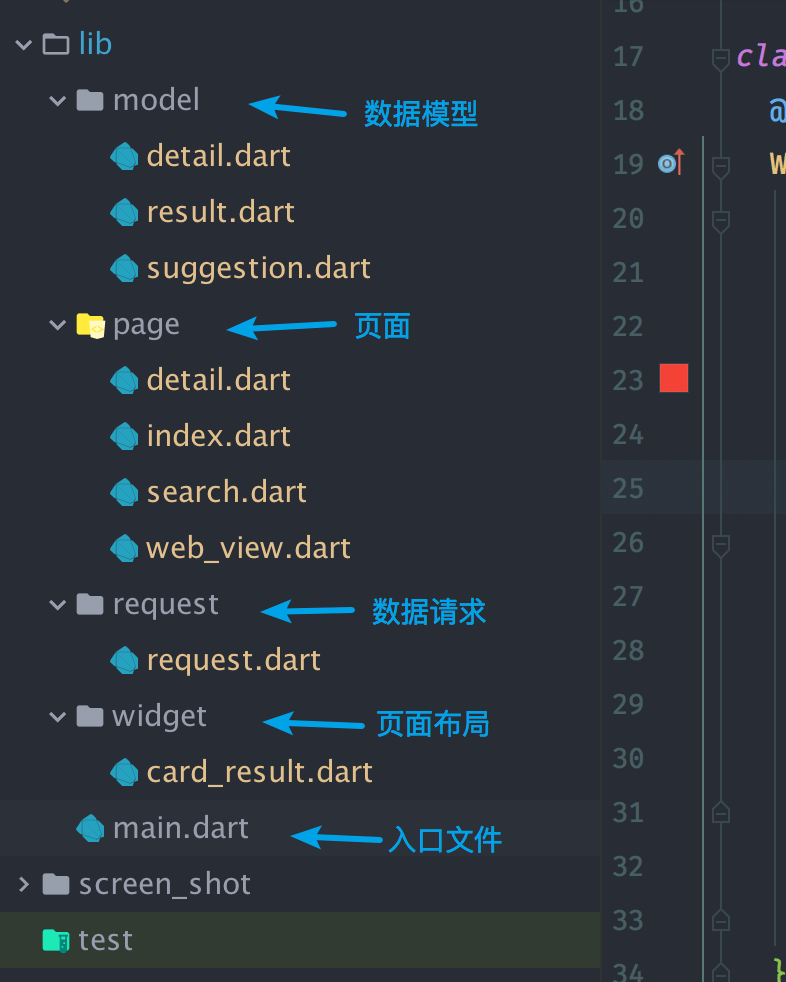
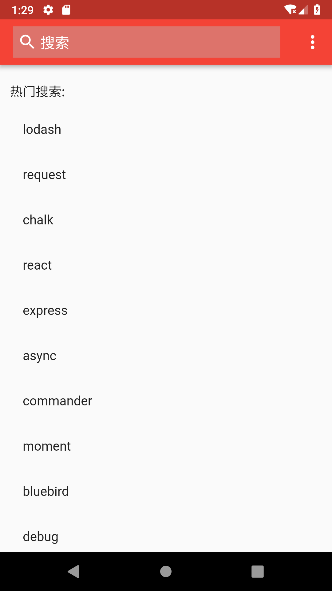
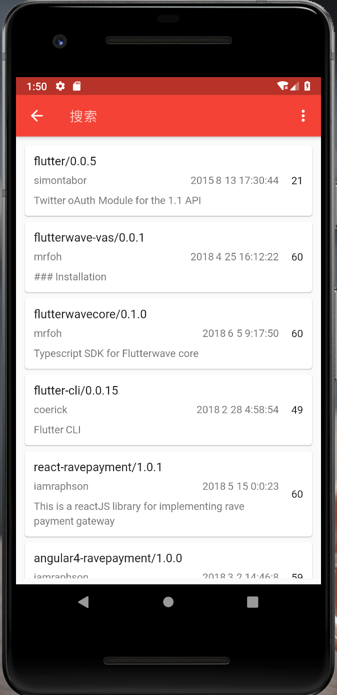
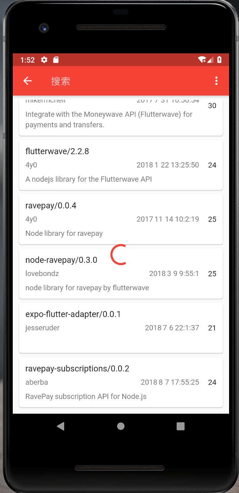
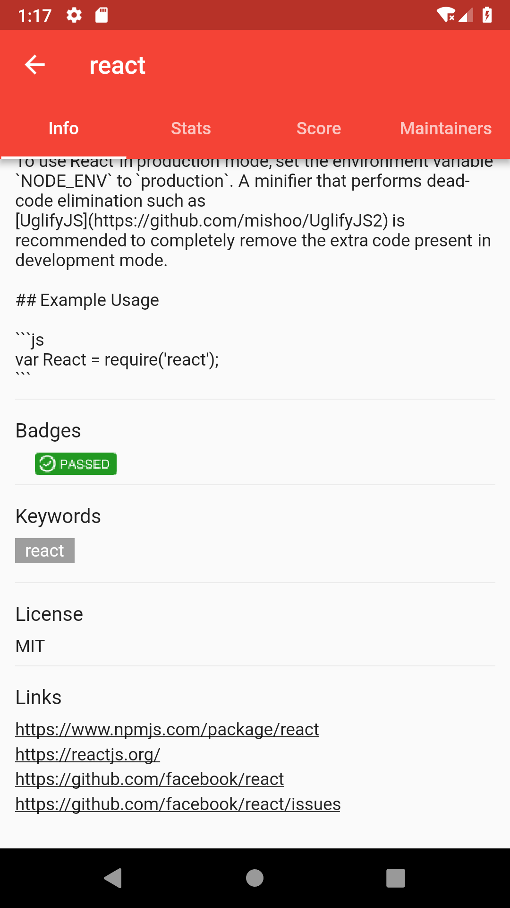
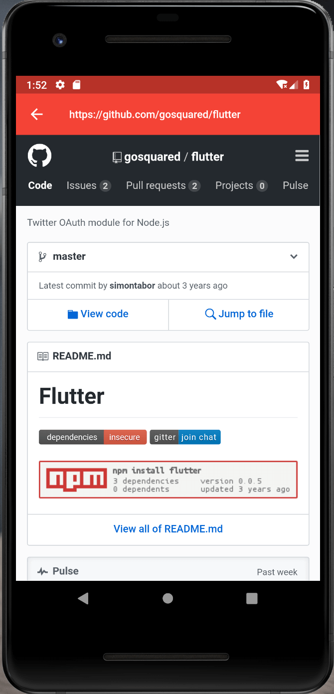
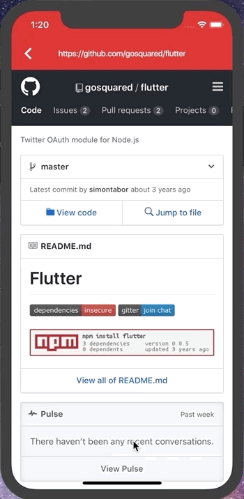

# flutter-npm-search

## 前言
这是一个使用Flutter框架开发的应用，主要功能是搜索npm上的package，显示package的信息，有4个页面，首页，搜索页， 详情页以及一个用来打开网页的WebView页面（使用flutter_webview_plugin插件），数据接口来自于[npms.io](https://api-docs.npms.io/)。
数据类有3个，分别是搜索结果类，包详情类以及搜索建议类。

目录结构

## 效果
首页

搜索页

无限加载

详情页

WebView页面

## APK
[download](./app-release.apk)
## TODO
输入时弹出搜索建议

搜索过滤

主题切换

储存搜索字段

获取热门搜索内容
## licence
MIT
## 
